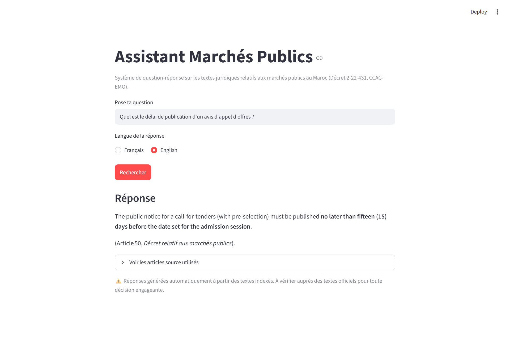
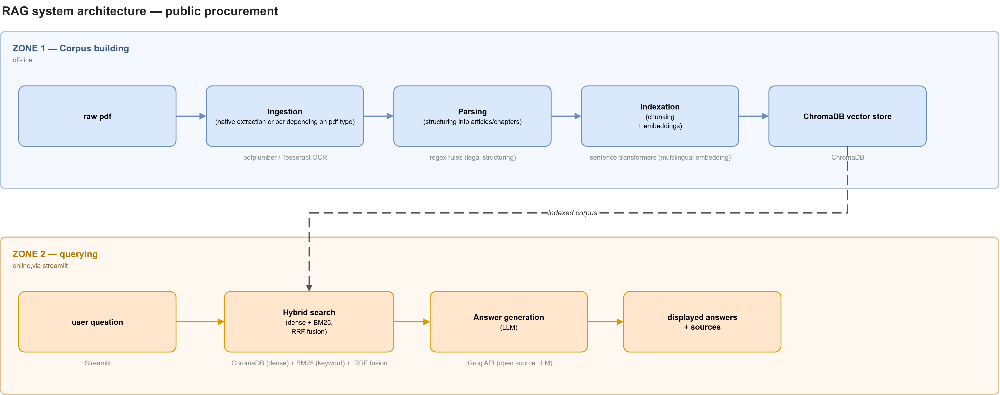
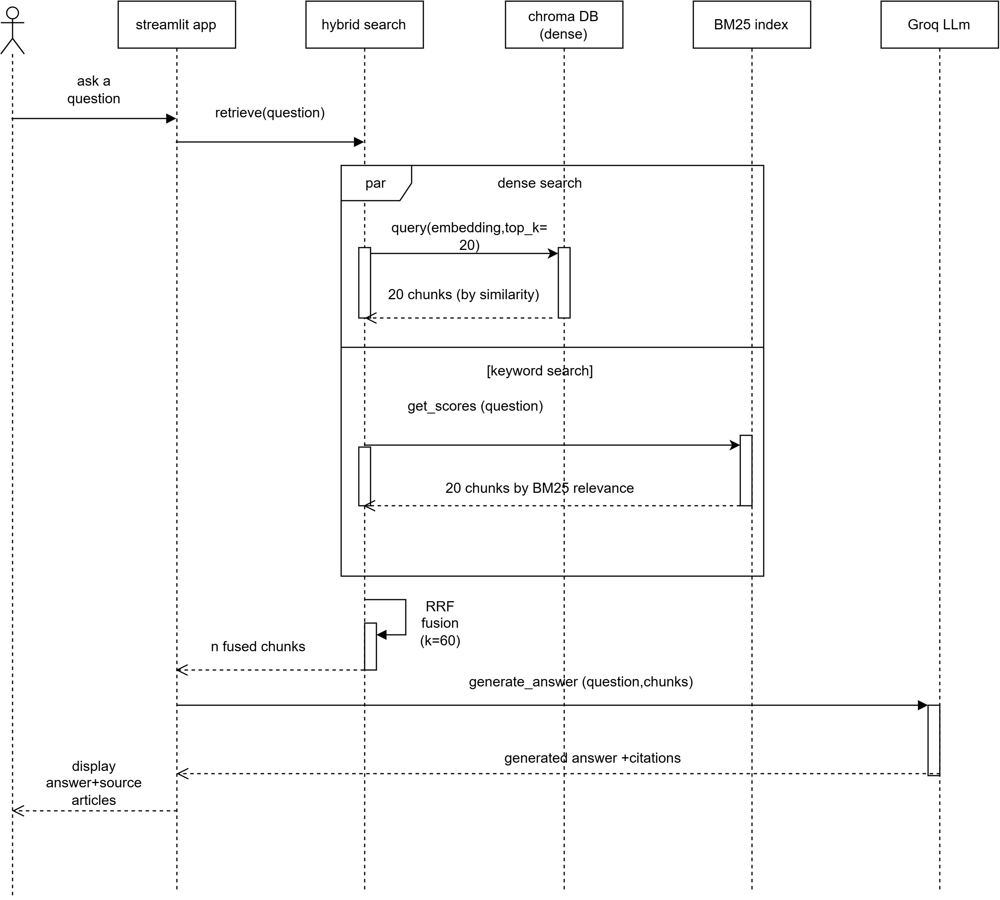

# Legal RAG System — Moroccan Public Procurement

A retrieval-augmented generation (RAG) system that answers natural-language
questions about Moroccan public procurement regulations, citing the exact
article and source document behind every answer.

## Live Demo

🔗 [Try the app](#) *(add your Streamlit Cloud link here once deployed)*



## Context

This project was developed during an application internship at the
DAAG (Direction des Affaires Administratives et Générales — 
General and Administrative Affairs Directorate), Ministry
of Economy and Finance of Morocco, to explore how a RAG-based system
could support legal research on public procurement regulations.

The system was built end-to-end — from raw PDF ingestion through
hybrid retrieval to answer generation — and evaluated on a manually
verified test set, achieving a measurable improvement in retrieval
precision (Precision@1: 41% → 53%) after introducing hybrid search.
The version presented here is a self-hosted demonstration built for
portfolio purposes.

## The Problem

Public procurement regulations are dense, hierarchically structured, and
frequently spread across multiple legal texts (decrees, technical
specifications, ministerial orders). Manually searching hundreds of pages
to find a specific rule is slow and error-prone — and citing the wrong
source when the answer matters is a real risk.

This project automates that search while ensuring every answer is
traceable to its exact legal source, a requirement that is non-negotiable
when dealing with regulatory text.

## How It Works

The system is split into two phases: an offline pipeline that builds a
searchable corpus from raw PDFs, and an online query flow that answers
user questions in real time.



**Offline — corpus building**
1. **Ingestion** — detects whether a PDF is natively digital or scanned,
   and extracts its text accordingly (native extraction or OCR), handling
   both single- and multi-column layouts.
2. **Parsing** — reconstructs the legal hierarchy (chapter, section,
   article) using pattern-based rules generalized across several document
   formats and numbering conventions.
3. **Indexing** — splits each article into one or more chunks, computes
   multilingual embeddings locally, and stores everything in a vector
   database.

**Online — querying**



4. **Hybrid retrieval** — combines dense (embedding-based) search with
   BM25 keyword search, merging both rankings through Reciprocal Rank
   Fusion (RRF) for improved precision on domain-specific legal terms.
5. **Generation** — the top-ranked chunks are passed to an LLM with an
   explicit instruction to answer strictly from the provided excerpts and
   to cite the article and source document for every claim.

## Results

Retrieval quality was measured on a manually verified test set of 17
questions spanning the full corpus, comparing dense-only search against
the hybrid approach:

| Configuration | Precision@1 | Precision@3 |
|---|---|---|
| Dense search only | 41% | 59% |
| Hybrid (dense + BM25 + RRF) | **53%** | **65%** |

The hybrid approach shows a clear improvement, particularly on questions
containing precise legal terminology. Remaining failure cases mostly
involve questions phrased with everyday vocabulary far from the legal
wording of the source text — a limitation discussed further below.

## Tech Stack

| Component | Choice | Why |
|---|---|---|
| PDF extraction | pdfplumber, PyMuPDF | Native text extraction with column-layout detection |
| OCR | Tesseract, pdf2image | Fallback for scanned documents |
| Text structuring | Python regex | Legal texts follow regular, learnable patterns — no ML needed here |
| Chunking | llama-index-core | Reliable sentence-aware splitting for long articles |
| Embeddings | sentence-transformers | Local, multilingual, no data sent to a third party |
| Vector store | ChromaDB | Embedded, no server to manage — easy to deploy |
| Keyword search | rank_bm25 | Complements dense search on exact legal terms |
| Generation | OpenAI API | Reliable, high-quality chat models |
| Interface | Streamlit | Single-process deployment, no separate backend needed |

## Project Structure

```
daag-legal-rag/
├── app.py                      # Streamlit interface
├── src/
│   ├── documents_registry.py    # Corpus configuration
│   ├── pipeline.py              # Offline pipeline orchestration
│   ├── ingestion/                # PDF extraction & OCR
│   ├── parsing/                   # Legal structure reconstruction
│   ├── indexing/                   # Chunking & embeddings
│   ├── retrieval/                   # Hybrid search (dense + BM25 + RRF)
│   └── generation/                   # LLM answer generation
├── data/
│   ├── raw/                     # Source PDFs
│   └── processed/                # Extracted text & structured JSON
└── tests/                       # Evaluation scripts
```

## Getting Started

### Prerequisites
- Python 3.10+
- [Tesseract OCR](https://github.com/tesseract-ocr/tesseract) and
  [Poppler](https://poppler.freedesktop.org/) if you plan to process
  scanned PDFs
- An [OpenAI API key](https://platform.openai.com/api-keys)

### Installation

```bash
git clone https://github.com/your-username/daag-legal-rag.git
cd daag-legal-rag
pip install -r requirements.txt
cp .env.example .env  # then add your OPENAI_API_KEY
```

### Build the corpus and index

```bash
python -m src.pipeline
python -m src.indexing.build_index
```

### Run the app

```bash
streamlit run app.py
```

## Known Limitations & Next Steps

- **Retrieval precision** — dense embeddings alone under-rank some
  correctly indexed articles when question wording diverges from the
  legal vocabulary. A reranking step is the natural next improvement.
- **No incremental indexing** — the vector index is fully rebuilt on
  every run; adding documents at scale would benefit from incremental
  updates.
- **Corpus scope** — currently limited to decrees, technical specification
  documents, and ministerial orders that follow a chapter/article
  structure. Amendments (*rectificatifs*) and annexes have a different,
  unstructured format and are not yet supported.
- **Document integrity checks** — a validation step was added after a
  source PDF was found to contain two unrelated legal texts merged into
  one file; this check now runs before any new document is added to the
  corpus.

## Disclaimer

This is a demonstration project built for portfolio purposes. Answers are
generated automatically and should be verified against official sources
before being relied upon for any real decision.

## License

MIT